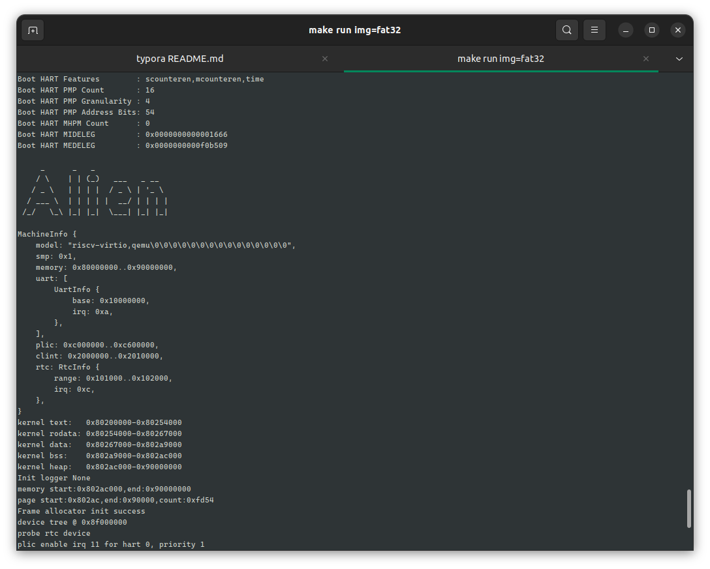

# Alien

A simple operating system implemented in rust. The purpose is to explore how to use modules to build a complete os,so the system is composed of a series of independent modules. At present, the system already supports user-mode programsand some simple functions.





## Modules

`pci` ：pci driver to detect devices on the bus

`rtc` ：rtc driver to get time

`page-table `： page table to manage virtual memory

`pager`： buddy and bitmap to manage frames

`gmanager`: a simple allocator to manage `process`/ `fd` and so on

`rvfs `: a vfs framework like linux, it can support multiple file systems

`fat32-vfs`: a disk file system, it can support fat32

`jammdb `: a key-value database, it can support `dbfs`

`dbfs2 `:  a disk file system, it is based on `jammdb`

`trace_lib `: stack trace library

`preprint ` : a simple print library

`rslab `: slab allocator like linux

`syscall-table `: A tool to automatically collect syscalls

`dbop`: Make database functions available to users as system calls

`plic`: riscv plic driver

`uart`: uart driver, it supports interrupt

Other modules are not listed here, you can find them in the cargo.toml file.


## Run

1. install qemu 7.0.0
2. install rust nightly

```
make run LOG=WARN img=fat32
```


## Doc

[文件系统接口](./doc/fs.md)

[下一步规划](./doc/target.md)

[测试](./doc/test.md)

[slab](https://github.com/os-module/rslab/blob/main/src/slab.rs)

[dbfs](https://github.com/Godones/dbfs2)

[物理页帧分配器](./modules/pager/README.md)

## TODO

- [ ] Thread/Mutil-core
- [x] full vfs
- [x] fat32
- [x] dbfs
- [x] Mutex
- [x] sleep task queue
- [x] uart task queue
- [ ] block driver task queue
- [x] a simple shell
- [x] memory management
- [x] process management
- [ ] ....


