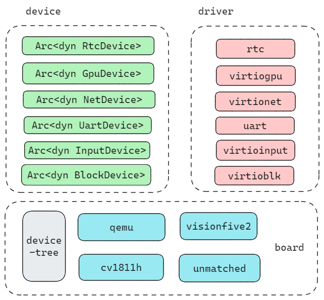

# 设备-驱动管理模型

AlienOS的设备驱动管理模型如下图所示:



## 板级设备

对于不同的平台或者开发板来说，其所搭载的设备是不一样的，对于这些设备如何配置，如何识别都是设备特定的，但是绝大部分的设备功能又是一样的。在board这一级别，不同的平台需要根据自己的特征找出所有设备。并注册到全局的设备映射表中:

```rust
pub static BOARD_DEVICES: Mutex<BTreeMap<DeviceType, DeviceInfo>> = Mutex::new(BTreeMap::new());
```

对与搭载riscv处理器的平台来说，大多数的机器都会使用设备树来保存机器上的设备信息。因此不同的平台要做的就是从各自的设备树中将设备信息解析出来。

每个平台都会实现两个必要的接口:

```rust
pub fn init_dtb(dtb: Option<usize>)
/// Get the base address and irq number of the uart device from the device tree.
pub fn probe_devices_from_dtb()
```

1. `init_dtb`会初始化本平台的设备树资源，在内核启动阶段，会根据用户在编译时指定的平台选择不同平台的实现
2. `probe_device_from_dtb`将会探测所有可用的设备，在设备初始化函数中，会根据用户在编译时指定的平台选择不同平台的实现

对于`probe_device_from_dtb`，不同的平台实现并不完全一样，但也存在一些共同的地方。

qemu上探测串口设备的实现如下:

```rust
pub fn get_device_info(fdt: &Fdt, device_name: &str) -> Option<(usize, usize)> {
    let res = fdt
        .all_nodes()
        .find(|node| node.name.starts_with(device_name));
    let res = res.and_then(|node| {
        if let Some(reg) = node.reg().and_then(|mut reg| reg.next()) {
            let addr = reg.starting_address as usize;
            if let Some(mut interrupts) = node.interrupts() {
                let irq = interrupts.next().unwrap();
                return Some((addr, irq));
            } else {
                None
            }
        } else {
            None
        }
    });
    res
}
/// Get the base address and irq number of the uart device from the device tree.
pub fn probe_uart() -> Option<DeviceInfo> {
    let fdt = DTB.get().unwrap();
    if let Some((base_addr, irq)) = get_device_info(fdt, "uart") {
        return Some(DeviceInfo::new(base_addr, irq));
    }
    None
}
```

在vf2开发板上探测串口的实现如下:

```rust
pub fn probe_uart() -> Option<DeviceInfo> {
    let fdt = DTB.get().unwrap();
    // get_device_info(fdt, "serial")
    let node = fdt.all_nodes().find(|node| node.name.starts_with("serial"));
    assert!(node.is_some());
    let node = node.unwrap();
    let mut reg = node.reg().unwrap();
    let irq = node.property("interrupts").unwrap().value;
    let irq = u32::from_be_bytes(irq.try_into().unwrap());
    let base_addr = reg.next().unwrap().starting_address as usize;
    Some(DeviceInfo::new(base_addr, irq as usize))
}
```

板级设备会提供一些统一的接口供外部模块来获取设备:

```rust
pub fn get_rtc_info() -> Option<(usize, usize)> {
    if let Some(rtc) = BOARD_DEVICES.lock().get(&DeviceType::Rtc) {
        return Some((rtc.base_addr, rtc.irq));
    }
    None
}

pub fn get_uart_info() -> Option<(usize, usize)> {
    if let Some(uart) = BOARD_DEVICES.lock().get(&DeviceType::Uart) {
        return Some((uart.base_addr, uart.irq));
    }
    None
}

pub fn get_gpu_info() -> Option<(usize, usize)> {
    if let Some(gpu) = BOARD_DEVICES.lock().get(&DeviceType::GPU) {
        return Some((gpu.base_addr, gpu.irq));
    }
    None
}

pub fn get_keyboard_info() -> Option<(usize, usize)> {
    if let Some(keyboard) = BOARD_DEVICES.lock().get(&DeviceType::KeyBoardInput) {
        return Some((keyboard.base_addr, keyboard.irq));
    }
    None
}

pub fn get_mouse_info() -> Option<(usize, usize)> {
    if let Some(mouse) = BOARD_DEVICES.lock().get(&DeviceType::MouseInput) {
        return Some((mouse.base_addr, mouse.irq));
    }
    None
}

pub fn get_block_device_info() -> Option<(usize, usize)> {
    if let Some(block) = BOARD_DEVICES.lock().get(&DeviceType::Block) {
        return Some((block.base_addr, block.irq));
    }
    None
}

pub fn get_net_device_info() -> Option<(usize, usize)> {
    if let Some(net) = BOARD_DEVICES.lock().get(&DeviceType::Network) {
        return Some((net.base_addr, net.irq));
    }
    None
}
```

这些公开的接口的作用就是从全局的设备管理表中读取对应类别的设备，并返回其地址空间和中断号信息。

通过使用rust的cfg条件编译，内核每次编译都只会为选择的平台生成代码，而不是所有平台

```rust

cfg_if! {
    if #[cfg(feature="qemu")]{
        mod qemu;
        pub use qemu::*;
    }else if #[cfg(feature="cv1811")]{
        mod cv1811;
        pub use cv1811::*;
    }else if #[cfg(feature="hifive")]{
        mod unmatched;
        pub use unmatched::*;
    }else if #[cfg(feature="vf2")]{
        mod vf2;
        pub use vf2::*;
    }
}
```

## 统一设备

在板级，各个平台向全局的设备映射表添加了不同种类的设备，不同平台的设备包含的功能有多有少，但我们只需要通用的基本信息和功能即可。因此，在设备层，我们使用trait来对不同的设备进行抽象，规定了不同类型的设备必须实现的功能。并且为每个设备提供一个全局的注册点和注册函数，比如对块设备来说，其trait约束如下：

```rust
pub trait Device: Debug + Sync + Send {
    fn read(&self, buf: &mut [u8], offset: usize) -> Result<usize, VfsError>;
    fn write(&self, buf: &[u8], offset: usize) -> Result<usize, VfsError>;
    fn size(&self) -> usize;
    fn flush(&self) {}
}
```

```rust
pub static BLOCK_DEVICE: Once<Arc<dyn Device>> = Once::new();

pub fn init_block_device(block_device: Arc<dyn Device>) {
    // BLOCK_DEVICE.lock().push(block_device);
    BLOCK_DEVICE.call_once(|| block_device);
}
```

对于GPU设备来说，其相关定义如下:

```rust
pub trait GpuDevice: Send + Sync + Any + DeviceBase {
    fn update_cursor(&self);
    fn get_framebuffer(&self) -> &mut [u8];
    fn flush(&self);
}

pub static GPU_DEVICE: Once<Arc<dyn GpuDevice>> = Once::new();

#[allow(unused)]
pub fn init_gpu(gpu: Arc<dyn GpuDevice>) {
    GPU_DEVICE.call_once(|| gpu);
}
```

这里还包含其它一系列设备，通过这种方式，可以对内核中的设备进行一个有效管理。

在系统启动阶段，会调用一个公开的`init_device`函数，其会对每一类设备进行初始化:

```rust
pub fn init_device() {
    probe_devices_from_dtb();
    init_uart();
    init_gpu();
    init_keyboard_input_device();
    init_mouse_input_device();
    init_rtc();
    init_net();
    // in qemu, we can't init block device before other virtio device now
    init_block_device();
    // init_pci();
}
```

需要注意的是这里`init_block_device`并不是上面的那个与全局注册点关联的注册函数，这些同名的函数做了更多的工作，但最后会调用这些注册函数进行注册，这里我们对其中一个设备进行说明， 其它设备也是如此。对于uart设备，其`init_uart`实现如下:

```rust
fn init_uart() {
    let res = crate::board::get_uart_info();
    if res.is_none() {
        println!("There is no uart device");
        return;
    }
    let (base_addr, irq) = res.unwrap();
    println!("Init uart, base_addr:{:#x},irq:{}", base_addr, irq);
    #[cfg(feature = "qemu")]
    {
        use ::uart::Uart16550Raw;
        let uart = Uart16550Raw::new(base_addr);
        let uart = Uart::new(Box::new(uart));
        let uart = Arc::new(uart);
        uart::init_uart(uart.clone());
        register_device_to_plic(irq, uart);
    }
    #[cfg(feature = "vf2")]
    {
        use ::uart::Uart8250Raw;
        let uart = Uart8250Raw::<4>::new(base_addr);
        let uart = Uart::new(Box::new(uart));
        let uart = Arc::new(uart);
        uart::init_uart(uart.clone());
        register_device_to_plic(irq, uart);
    }
    UART_FLAG.store(true, Ordering::Relaxed);
    println!("init uart success");
}
```

1. 从板级设备的公开接口`get_uart_info` 获取串口信息
2. 若串口不存在，则返回
3. 若串口设备存在，那么根据编译时指定的平台信息，选择不同的驱动实现
4. 设备完成初始化，被注册到全局的注册点中

## 驱动

虽然各个平台的设备并不完全一样，但是这些设备可能都符合某一个规范，因此设备驱动程序的编写也并不是每个平台每个设备都有一个，相反，对于很多设备，都可以使用同一套初始化代码，例如串口，rtc，HDD硬盘设备，显示设备等，因此我们可以复用一些驱动的代码。因为我们主要的精力放在了qemu模拟器上，而riscv的机器使用的大多数是virtio-mmio类型的设备，因此可以使用社区中已有的驱动实现，而对于串口，rtc，SD卡这种与virtio截然不同的设备，则需要单独实现。

在设备层，我们使用了trait系统来对不同类型的设备进行约束，我们希望这些设备实现上述这个trait所需要的功能。

因此在驱动层，我们在为不同类型的设备实现驱动时，也会为这些设备实现这些trait。因为内核是模块化的，所以来自外部模块的驱动并不一定能完全适应内核的需求，一般我们会对其进行包装，然后在包装的结构上，编写适合内核需求的代码，其中一些典型的封装如下所示:

```rust
pub trait LowBlockDriver {
    fn read_block(&mut self, block_id: usize, buf: &mut [u8]) -> Result<(), VfsError>;
    fn write_block(&mut self, block_id: usize, buf: &[u8]) -> Result<(), VfsError>;
    fn capacity(&self) -> usize;
    fn flush(&mut self) {}
}

pub struct VirtIOBlkWrapper {
    device: VirtIOBlk<HalImpl, MmioTransport>,
}
pub struct MemoryFat32Img {
    data: &'static mut [u8],
}
impl LowBlockDriver for MemoryFat32Img;
impl LowBlockDriver for VirtIOBlkWrapper
pub struct GenericBlockDevice {
    pub device: Mutex<Box<dyn LowBlockDriver>>,
    cache: Mutex<LruCache<usize, FrameTracker>>,
    dirty: Mutex<Vec<usize>>,
}

impl Device for GenericBlockDevice;
impl InputDevice for VirtIOInputDriver;
```


```rust
pub struct VirtIOInputDriver {
    inner: Mutex<InputDriverInner>,
}
struct InputDriverInner {
    max_events: u32,
    driver: VirtIOInput<HalImpl, MmioTransport>,
    events: VecDeque<u64>,
    wait_queue: VecDeque<Arc<Task>>,
}
```

这些封装了底层驱动的高层驱动会实现设备层定义的trait，这样一来，在设备层调用驱动进行初始化后，就可以直接向全局注册点注册了。