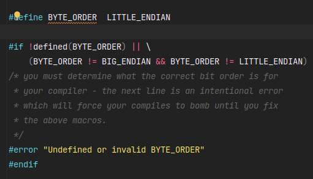

# Redis

## 简介

Redis（Remote Dictionary Server）是一个开源的、基于内存的键值存储系统，也常被称为数据结构服务器。它被设计用来快速、高效地处理各种类型的数据，包括字符串、哈希、列表、集合、有序集合等。Redis 的目标是提供一个高性能、可扩展、灵活且多功能的数据存储解决方案。

## 下载链接

```plaintext
http://download.redis.io/releases/redis-3.2.9.tar.gz
```

## 编译

```
1. install musl-gcc
2. build
MUSL_PREFIX = riscv64-linux-musl
MUSL_GCC = $(MUSL_PREFIX)-gcc
cd ./redis-3.2.9 && make CC=$(CC) MALLOC=libc persist-settings # 编译依赖库
cd ./redis-3.2.9 && make CC=$(CC) MALLOC=libc # 编译redis
```

## Run

```
server: redis-server redis.conf &
bench : redis-benchmark -n 1000 -c 1

client: redis-cli
```


## 注意事项

1. 编译出现错误`#error "Undefined or invalid BYTE_ORDER"`

解决方法：

在`config.h`文件中



一般我们的机器都是小端机器，因此直接`#define BYTE_ORDER  LITTLE_ENDIAN`


## Ref

https://github.com/rcore-os/rcore-user#how-to-run-real-world-programs

https://musl.cc/

https://learnku.com/articles/15128/compile-and-install-redis-under-the-linux-environment

https://gitlab.eduxiji.net/19373469/oskernel2022-x/-/blob/main/docs/redis.md  
