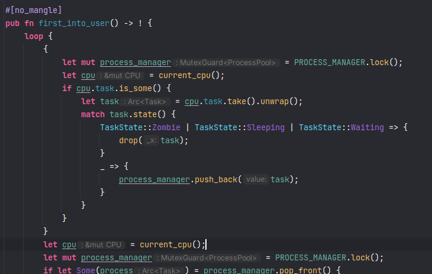
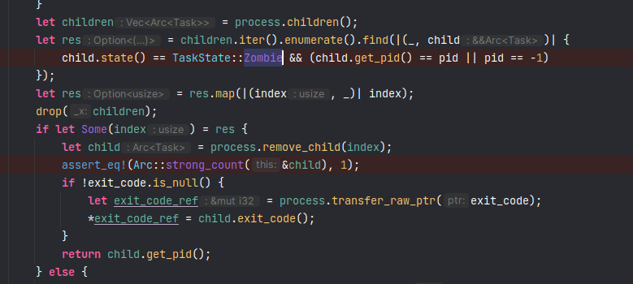
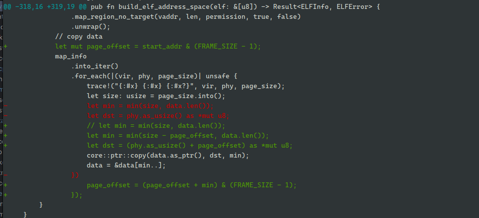
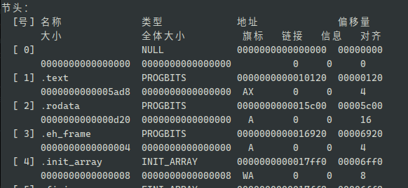
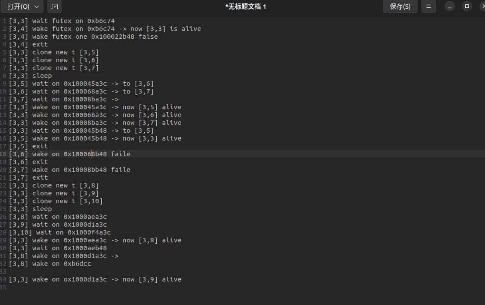
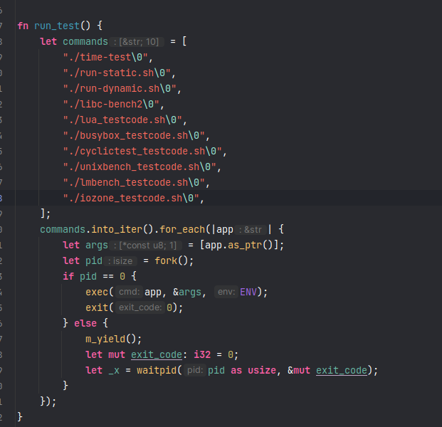
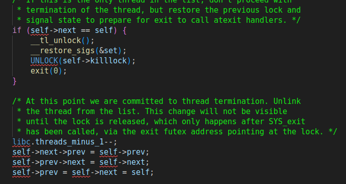
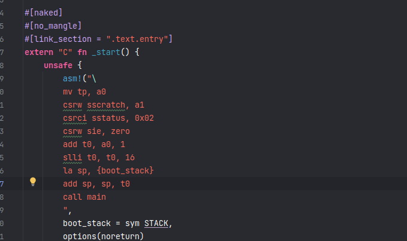
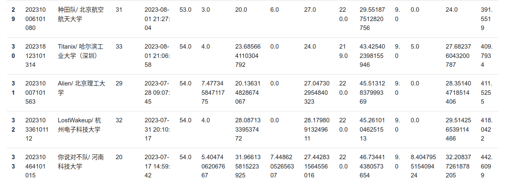
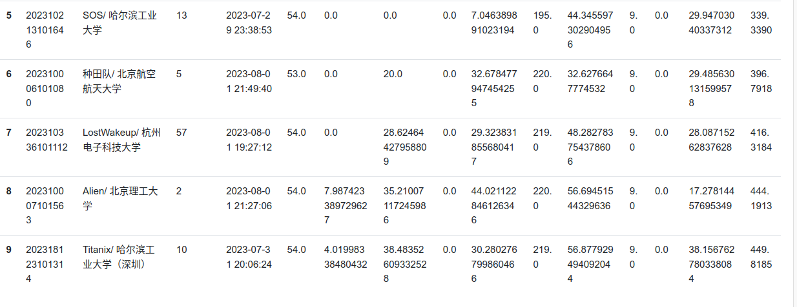

# 开发日志

记录开发过程

## 2023.6.9

1. 修该页帧分配器的测试，通过`trait`可以让`Bitmap`与`Budyy`使用同一套测试方法 。
2. 替换内核中的页帧分配器为`Buddy`，并修改相应的数据结构，由于slab会提供8MB大小的块分配，这会需要2048个页因此调高了页帧分配器的最大页数。

## 2023.6.10

1. 修复`rvfs`中关于mount的实现错误，现在一个文件系统可以挂载在多个目录上
2. 修复`dbfs`中关于`readdir`的实现以及mount相关的错误，修复了`fat32`中关于`readdir`的实现错误以及mount相关错误

## 2023.6.11

1. 实现`devfs`，加入`rvfs`框架中。
2. 在内核中添加设备文件系统支持，将`ramfs`重新挂载在`/tmp`目录上

## 2023.6.12

1. 添加多核启动的支持

内核中一些数据结构需要根据CPU数量进行初始化，但是直接在内核中指定CPU数量会导致改变qemu启动的CPU参数时也随之更改内核的参数，因此我们采取了在`build.rs`中根据命令行参数生成内核参数的方法，动态地修改正确的CPU数量。

同时在实验中我们发现，`opensbi`在进入到内核时，`sstatus`的`spp`字段居然是用户态，不知道是不是qemu版本的原因，目前的解决方案就是在主函数第一句手动修改回来。

```rust
pub fn main(hart_id: usize, device_tree_addr: usize) -> ! {
    unsafe {
        set_spp(SPP::Supervisor);
    }
}
```

## 2023.6.13

1. 学习`arceos`中页表实现，将之前的实现替换掉

## 2023.6.14

1. 为`clone`系统调用添加copy-on-write功能

page-table中存在父子进程共享同一个页面的情况，这时候如果父进程释放了这个页面，那么子进程的页面也会被释放，这时候子进程的页面就会被覆盖，这是不允许的，为了解决这个问题，我们需要管理物理内存的分配情况，在前面我们已经使用伙伴系统接管了物理内存的页分配，但是出现了一些物理页被重复使用的情况，因此需要一个管理机构来记录每个物理页的使用情况。

在进程进行`fork`时，子进程获得了父进程的页表的一份拷贝，这份拷贝包含了几个重要的信息

1. 页表根地址
2. 在建立页表时申请的物理页帧
3. 建立映射的虚拟地址

我们会根据第三个信息，将页表中所有包含写标志位的映射的`D`位置置为0，这样当父进程或者子进程进行写时就会触发异常，对这个异常，父子进程都会取消掉这段映射，并申请页面来重新映射这段虚拟地址，拷贝数据，设置相应的标志位。

由于父子进程同时拥有上面提到的第二个信息，而当进程退出时，页表会向内核回收这些申请的物理页帧，如果父进程提前退出，但是子进程仍然需要这些物理页，就会造成子进程在拷贝数据时出错，因为被回收的页面可能被清零或者被其它模块申请。

**物理页帧管理机构**的作用就是在物理页进行分配或者回收时记录物理页的持有情况：

1. 当物理页首次被分配时，其持有计数为1
2. 在需要共享物理页的位置，使用者需要手动添加其持有计数
3. 当物理页被回收时，管理机构首先递减持有计数，并在计数为0 时归还到伙伴系统中

WARN：这需要使用者小心物理页的共享情况

这个管理机构如何更高效管理这些信息呢？因为有时候其他模块会申请连续的多个页面，并在存在共享时递增这一个区间的持有计数。即我们需要记录单个物理页或者连续物理页的持有计数，为了简化，这里我们禁止出现将连续物理页拆分的情况，即不允许单独对连续区间中的子区间或者单个页面增加计数，毕竟既然作为一个整体被分配出去，就应该作为一个整体进行回收。

**物理页帧管理机构**的数据结构定义如下:

```rust
pub struct FrameRefManager {
    record: HashMap<usize, usize>,
}
```

其主要的成员函数有两个:

```rust
pub fn add_ref(&mut self, id: usize) -> usize {
        if let Some(count) = self.record.get_mut(&id) {
            *count += 1;
            *count
        } else {
            self.record.insert(id, 1);
            1
        }
    }
pub fn dec_ref(&mut self, id: usize) -> Option<usize> {
    if let Some(count) = self.record.get_mut(&id) {
        *count -= 1;
        if *count == 0 {
            self.record.remove(&id);
            let start_addr = id << FRAME_BITS;
            unsafe {
                core::ptr::write_bytes(start_addr as *mut u8, 0, FRAME_SIZE);
            }
            FRAME_ALLOCATOR.lock().free(id, 0).unwrap();
            return Some(id);
        }
    } else {
        panic!("dec {} ref error", id);
    }
    None
}
```

其职责就是为需要共享的物理页帧增加或减少引用计数，并在计数为0时回收到伙伴系统。

在执行fork时需要处理的一个细节是对于`trap_context`的处理，这被单独映射成了一页，并且里面存储了一个子进程独有信息，因此在进行COW时，这一页不能共享。

由于引入了物理页帧的引用计数，因此需要页表模块与内核部分一同处理页面的分配情况，这部分要小心处理，不然容易发生多释放的错误。


## 2023.6.15

1. 为内核添加`lazy page allocation` 功能

在进程进行`mmap`或者 `sbrk`操作时，由于应用程序不知道需要多大的空间，因此其可能会请求一个很大的内存区间，如果内核直接满足程序的要求，就会分配大量的内存，但是应用程序可能并不会使用所有分配的区域，因此一个方法就是延迟分配，内核在页表中建立一个无效的映射，当程序真正进行访问时，内核再进行实际的内存分配并建立有效映射。


## 2023.6.20

1. 修改`page-table`的实现，以更优雅的方式记录地址映射情况，减少手工管理物理页帧的麻烦
2. 添加`brk`和 `mmap` 的`lazy page allocation`功能

在处理`COW`时，需要考虑页表项无效的情况，这时候不需要共享页面，也不需要将写标志去除，只需要按照原样映射即可。


## 2023.6.21/6.24

1. 添加gui的支持，第一个测试程序`guitest`来自`rcore` ，主要使用的是**embedded-graphics** 库
2. 添加`slint` 框架的测试，显示一个简单的图形界面


由于包含图形界面的程序需要的栈空间较大，因此需要调高应用程序的栈大小。


## 2023.6.24

1. 添加内核同步原语`Mutex`， 来自https://gitee.com/chyyuu/kernel-sync?_from=gitee_search

此仓库包含了`spin_mutex`和`ticket_mutex`，但其限制了cpu数量为4,我们将定义cpu数量的代码在`build.rs`中重写。与多核启动的方式类似。

2. 修改内核使用的锁，替换成新的实现。只替换了部分。
3. 规范串口驱动的实现，思考如何将带等待队列的串口驱动独立出去。

由于串口内部使用了互斥锁，而这个锁一般被实现在内核中，这种外部模块依赖内核功能的情况是经常发生的，这里暂时想到的一个方法是看能不能使用接口来屏蔽掉这种依赖。


## 2023.6.25/26

1. 添加键盘/鼠标外设的支持
2. 添加睡眠锁，当进程获取锁时如果锁已经被其他进程获取，则当前进程被加入到等待队列中，当锁被释放，会唤醒队列中等待的进程。
3. 将rust编写的测试程序集中到一个单独的`tests`crate中，通过制定测试的名称运行相应的测试。
4. 为`slint` gui程序添加鼠标和键盘事件支持，现在计数器程序可以运行，但是鼠标的坐标处理需要进一步细化。


## 2023.6.27

1. 添加一个`memory-game` ，使用`slint`
2. 修复`page-table`中`unmap` 的错误

## 2023.6.29

1. 编译libc/busybox相关测例
2. 尝试运行测试，爆出许多错误

## 2023.6.30

1. 修复musl-libc中初始化失败的bug

原来内核中对`execv`参数的处理比较简单，没有按照libc的要求进行放置，导致进入到用户态总是发生`loadpage`异常，在按照libc的初始化过程重新放置参数和环境变量后，没有发生异常，但是程序会卡死。使用gdb单步调试后，发现其在获取hartid时发生了错误，在内核中，我们将hartid放置在tp寄存器中，但是用户态程序使用了这个寄存器，在之前的实现中，进程陷入内核时，我们不没有恢复tp的值，导致tp的值是用户态设置的值，而在异常处理和panic程序中，都会获取hartid，因此直接导致了内核处于panic的死循环中。


## 2023.7.1

1. 添加线程打初步支持

主要参考去年的作品`maturin`，将进程和线程使用同一个任务控制块进行抽象。

## 2023.7.2

1. 添加多核调度的支持

   1. 修复了获取当前cpuid失败的错误，在跳板页中回到用户态前，需要将当前hart id保存到指定位置，并在进入到内核态时恢复。

   2. 修复任务切换时出现打错误

      多核情况下，如果另外一个cpu正在从manager中获取task，而此时当前核正在保存这个task的context，在没有保存完整的情况下，另外一个cpu已经将这个task从manager中取出，并进行switch恢复context，这会带来问题。为了解决这个问题，我们将对当前任务的处理移到位于当前核的循环处理中。

      

   3. 修复任务退出时可能出现打错误

   在一个任务退出时我们会更改任务的状态标志，但是这时候可能在另一个核上运行的父进程在回收这些任务，他可能会发现任务状态变成了`Zombile`，然后就会尝试将其从列表中删除掉，但由于另外一个核上还没有退出完成，对退出的判断逻辑就会出错

   

​	这里对任务引用计数的判断会出错。这里的解决方法是为任务添加一个状态`Terminated`， 在任务调用`exit`时，它的状态是`Zombile`，在`wait pid`时，将判断条件修改为

```rust
child.state() == TaskState::Terminated && (child.get_pid() == pid || pid == -1)
```

而`exit`时会发生任务上下文切换，在这部分，通过修改判断逻辑，将处于`Zombile`的任务状态修改为`Terminated`。这样就可以防止任务被提前回收掉。

1. ​	修复有关物理页共享的bug

在进行COW拷贝时，需要在新的任务中记录共享了哪些页面，这样在exec时才能正确地将那些共享的页面的计数减一。

2. 修复有关进程栈大小打bug

原来我们给每个任务的栈大小为4k，但是下午一直跑发现总是会出现奇怪打错误，一会儿是卡住不动，一会儿是访问了一些奇怪的地址。最终折腾一下午，在晚上的时候在之前卡住的位置打印了一些数据，发现这些数据不正确，仔细一想，这应该是栈跑飞了，增加栈的大小后，运行成功了。

## 2023.7.3

1. 解决一个困扰了两天的bug：musl-libc初始化阶段访问0地址错误

libc中的


函数会读取`init_array_start`这个函数指针数组的值，并跳转去执行，从elf文件中可以看到




这个符号的位置就位于第二个加载段的起始位置，因此当libc读取这个位置时，理论上会读到一个正确的值，但是在解决这个问题前，我们对elf的文件加载时并没有按照正确的偏移去加载数据，导致了这个位置上的数据是错误的，在针对我们自己编写的rust测例没有问题是因为我们对链接脚本做了对其4k大小的操作，这样每次只需要把数据加载到页面开始的位置即可。

## 2023.7.4-7.5

1. 添加更多syscall支持，运行大多数lib-test测例
2. 修复文件系统相关的错误，并进一步对文件进行抽象

## 2023.7.6

1. 记录一次`visionfive2`debug

在将os运行到开发板时，之前运行良好的代码出现了错误，出现的第一个错误是一个地址访问错误，内核触发了`LoadFault`错误，查看具体的值发现是一个很大的地址值，并且错误发生在slab分配器的初始化过程中。由于无法使用gdb工具进行单步调试，因此只能在代码中插入一些打印的语句，通过打印发现：


在从内核获取页面后，进行slab块初始化时，会计算第一个对象的地址，而发生错误的原因是这里的`color next`值是一个错误值，在进一步查看cache的初始化代码，发现没有包含对其初始化，在加入一行初始化的代码后，解决了这个问题。

第一个问题解决后，发现程序还是卡在了紧接着的代码中


通过打印得知这里获取锁失败了，但理论上在初始化阶段不会出现竞争，因此获取锁判断值肯定出错了，仔细思考后，发现这些对象全部都从裸指针转换而来，而裸指针又是从内核的物理页面转换得到，因此当这些物理页在发配时没有经过清空的话，直接使用裸指针就会造成一些值出现错误，通过在分配物理页进行清空数据，这个问题得到了解决。


## 2023.7.7

1. 在cv1811h开发板启动os

bug1：启动后无法打印

解决方法：打印前先清空bss段，`.bss`段没clear干净，导致未初始化时的原子变量存在了随机值，持续死锁。

https://github.com/rcore-os/zCore/blob/cv1811/docs/README-C910.md 

bug2：建立好页表后开启mmu卡死

解决方法：根据上面网址给出的提示可以得知由于c906对页表项进行了扩展，由此需要设置页表项的高位才能正确地运行。第二种方法就是在sbi启动阶段将`mxstatus`的`maee`位关闭。

暂时放弃cv1911的启动

2. 添加线程和信号的完整支持

对于线程创建来说，其使用`clone`系统调用，通过控制其参数来达到一个创建线程的效果，具体来说，libc的线程库会使用`CLONE_VM` 、 `CLONE_FILE`等参数，使得新创建的子进程共享父进程的资源，这样这些子进程就变成了理论上的线程。

但由于前面我们只支持创建子进程，其会使用cow机制拷贝父进程的地址空间，并且可以分配子进程的`trap_contex` 页，


## 2023.7.8

1. 删除掉当`execv`无参数时额外增加的可执行程序名称的参数

在一般的shell中，输入命令后shell会向执行都命令传入参数，而一般来说，参数的第一个都是执行的命令的名称。之前我们是在内核的`execv`中手动判断是否参数为空并手动加入程序的名称，但在执行`busybox`的相关命令时，发现`busybox`会往第一个参数放置程序的名称，因此我们手动加入一个额外的就会造成错误。解决方法是我们在自己编写的简易`shell`中按照一般方法放置了参数。

1. 在自己编写的os中程序运行与qemu镜像不一致，因此需要根据运行的错误进行调整

在添加系统调用过程中，一般参考`debian`中程序的执行流程，但是实验发现，我们的os与其执行的系统调用并不完全一致，因为我们的os中缺少linux中一些功能或者说前置的系统调用结果与linux中不一样导致了这种情况发生。但总体而言关键的系统调用是一致的。

1. 增加对`FutexRequeuePrivate` 的处理
2. `sigtimewait`会使得任务睡眠，是否在必要的时候唤醒任务，因为子任务也许已经完成 

目前的处理是没有检查信号是否来了。


- [x] 无法连续运行这些测试，任务退出后有必要删除掉无用的内容

- [x] 任务栈上的数据被覆盖掉，无法进行正常的系统调用 ----> buddy allocater for page is error

检查发现使用伙伴算法的页面分配器有错，暂时换成位图算法后即可。后续需要检查伙伴算法的错误。

- [x] 保证任务退出状态更新与引用计数减少原子性。

在任务退出时，我们更新了任务的状态，同时父进程会等待子进程的退出，当在多核环境中时，如果子进程更新状态后父进程可能会立即监听到，但是由于此时子进程的引用计数还没有减少，那么父进程的判断就会出错。所以需要保证在更新状态结束时，引用计数也减少。


对于多线程程序，调试手段只能一步步观察各个线程发起的系统调用。





## 2022.7.10

1. `getdents`系统调用需要文件系统维护目录的偏移量，就像普通文件一样，在使用这个系统调用时，这个偏移量会变化，从而完成读取目录中文件的功能。需要注意的是，如果在读取过程中，这个目录下有文件被删除了，那么这个偏移量可能会出错。==这里为了简单不考虑这种情况==
   - [x] fat32
   - [x] devfs
   - [x] ramfs
   - [ ] dbfs


## 2022/7/11

- [x] 增加busybox的支持
- [x] 添加`ppoll`调用，需要对文件进一步处理

1. 在测试busybox时由于我们将测试程序放在了`/final`目录下，因此需要调整测试脚本的文件路径，或者后面直接将测试程序放到根目录下

## 2022/7/12

1. 处理测试程序的运行问题

2. 将程序放到根目录下，并在execv时处理sh文件
3. 添加lua的支持
4. 添加共享内存相关的系统调用，供iozone使用

## 2023/7/13

1. 添加iozone的支持  https://www.cnblogs.com/licheng/archive/2008/06/30/1232527.html

- [x] vfs中添加与`poll`   `pselect` 系统调用的支持

在`File`定义内部，我们扩展了几个功能，这些函数用来探测文件是否可读、是否可写、以及是否损坏等，需要为这个扩展功能提供默认实现。

- [x] 如何处理`/dev/tty`

tty回显问题：https://gitlab.eduxiji.net/2019301887/oskernel2022-npucore/-/blob/master/Doc/debug/TTY%E4%B8%8D%E5%9B%9E%E6%98%BEbug.md

不需要在内核中输出，bash会根据系统维护的值选择是否调用`writev`

## 2023/7/16

1. 添加网络的基本支持
2. 修复`pselect`中都bug，`pselect`会在参数中说明要监听的文件，因此判断时不能仅根据数量去查找，还需要从参数中拿到程序需要监听都文件。

## 2023/7/17

1. 添加网络相关的更多系统调用

## 2023/7/18

1. 添加动态链接的支持

动态链接的支持需要读取elf文件的`INTERP`段查找到动态库，并按照之前加载可执行文件的方式加载动态库到内存中，同时，针对动态库中的`.rela.dyn .rela.plt` 等段，需要对里面的符号进行重定位操作。

https://zhuanlan.zhihu.com/p/77264742

https://blog.csdn.net/dai_xiangjun/article/details/123629743

https://bbs.kanxue.com/thread-270935.htm

http://nicephil.blinkenshell.org/my_book/ch07.html 比较细致


动态链接器在加载真正的程序时，会使用mmap系统调用映射，而且要求内核为其分配的虚拟地址程序的相同，在之前，内核对用户的mmap系统调用会从一个固定的地址开始分配，因此这部分需要修改代码来适配，同时，动态链接器还会使用带`MAPFIXED`的mmap来对映射的地址空间进行重映射，这有可能导致一段连续的地址空间变成两部分或者三部分，同时如果映射了文件，文件的起始偏移量也会被修改。

在之前的实现中，我们忽略了指令页异常处理，在动态链接程序中，由于使用了mmap进行懒加载机制，因此代码段可能会发生缺页异常，需要新增代码处理。

## 2023/7/19-2023/7/21

1. 添加lmbench的支持

- [x] 修复内核于用户程序参数传递的问题：使用`copy_to/copy_from`系列
- [x] 在`trap`上下文保存浮点数
- [x] 增加用户栈大小


## 2023/7/22-7/23

1. 添加libc-bench的支持
1. 添加unixbench的支持

- [x] 修复`write`系统调用返回值错误
- [x] 添加未支持的系统调用`sigsuspend`
- [x] 正确处理task的`timer`， 需要在发生任务切换时以及内核态和用户态切换时检查是否超时，并发送信号
- [x] 处理时钟中断被忽略的问题 [unixbench.md](unixbench.md)

## 2023/7/23-7/28

1. 进行联合测试

在前期我们对每个测试都单独进行了测试并独立通过了每个测试，但是最后我们需要将这些测试一起运行。由于对网络的支持不够完善，因此不能直接使用包含全部测试的测试脚本，在`init`程序中，我们手动运行已经支持的测例。



2. 增加不同的内存分配器

   - [x] buddy
   - [x] talloc
   - [x] slab

3. 修复一系列错误

   - [x] 增加堆空间大小
   - [x] 减小用户程序内核栈大小
   - [x] 减小内核栈大小
   - [x] 修复fat32删除文件失败的问题 [fat32删除文件](fat32.md)

4. 改进

   - [x] 增加时间片大小
   - [x] 缺页异常重试

   在多线程测试中，有的测试程序会连续创建多个线程，但是线程可能什么也不做就立即退出，如果在主进程未完成线程初始化的情况下线程被调度得到运行，那么线程退出很可能会触发缺页异常而失败。

   在libc中的线程创建代码中：

   

​	这里会初始化线程描述符的相关字段

​	而在线程退出的代码中：



​	这里会访问上述的相关字段。如果线程先退出而访问了这些字段，就会出现错误。为了避免这种错误，我们在线程发生缺页异常时，先将其切换掉，换别的线程运行，在下一次被调度执行后，如果主进程完成了初始化，那么他就可以继续运行，否则其可以再尝试几次，当到达尝试上限后，内核会选择杀掉它。

而通过增加时间片大小，也可以一定程度上解决这个问题。==观察到线程创建前后有两行获取锁和释放锁的操作，目前不知道是否是内核处理不当导致，需要后续对这里进行处理==


## 2023/7/29-7/30

1. 在visionfive2上进行测试
2. 提交vf2和unmatched开发板评测

- [x] 修复内核栈赋值错误

- [x] 修复内核栈较小出现的bug

在qemu上进行测试时，由于物理内存有限，因此之前我们将其内核栈大小由64kb减小为8kb，但是

在物理板子上测试时，发现启动后内核会卡死不动，这种情况一般会怀疑栈错误，因此在卡死的函数内，我们打印了sp的值，并在内核启动时查看内核栈区间，发现确实是栈到了错误的位置，一开始怀疑栈小了，在把栈增大到64kb后，发现似乎还是不行，再检查栈指针的值，发现其位于bss段，明显比我们设置的大了一个栈大小，于是我们检查了启动代码，一看居然问题就在这里



在启动代码中，我们根据cpu的编号设置栈区间，但是在visionfive2上，其使用了sifive的ip核，这个ip核的第一个cpu是一个特殊的cpu，不会被主动启动，因此cpu的编号会从1开始，而qemu 的是0,因此如果要在板子上运行，我们就不需要上述代码中+1的操作。

在修改后，发现内核可以运行后，我们又将内核栈减小，发现运行到一半，又卡死了，于是老套路，我们打印了sp的值，发现其栈指针确实又不在区间内，我们之好将内核的栈增大。

- [x] 使用ramdisk

由于目前sdio驱动的实现没有完成，看到往年有选手直接内置了评测镜像，因此我们也参考这个方法，将评测镜像嵌入到内核中，作为一个内存disk实现，同时，由于线上评测不会使用mkimage制作镜像，因此我们不得不将设备树嵌入内核，因为内核初始化需要从设备树获取信息。

## 2023/8/1

1. 退出评测模式，恢复正常的os过程
2. 重构内核设备驱动管理部分的代码 [architecture](./architecture.md)
3. 添加visionfive2的串口驱动 [uart](uart.md)
4. 更新plic驱动 [PLIC](plic.md)

为了运行测试，我们修改了内核中部分代码，以获得更高的分数，在提交完评测后，我们将os恢复到之前的状态。为此，我们删除了一些将可执行文件包含到内核的代码。同时，对于init程序，其不再直接运行评测程序，而是直接启动bash。

qemu



starfive


unmatched




## 2023/8/2-8/4

1. 整理代码
2. 添加visionfive2的sdcard驱动支持


## 2023/8/5-8/9

1. 添加网络支持

```
[tid 3] TCP 
[tid 3] socket 3 bind to 127.0.0.1:12865
[tid 3] listening :: pselect

[tid 4] TCP 3   ---- 127.0.0.1:49152
[tid 4] socket 3 bind to 0.0.0.0:0
[tid 4] connect 127.0.0.1:12865
[tid 4] UDP 4
[4] socket 4 bind to 0.0.0.0:0
[4] getname 4 0.0.0.0:38181    ---- 0.0.0.0:49157
[4] socket 3 send to 127.0.0.1:12865  656bytes
[4] pselect 3 wait 
[4] recv from 127.0.0.1"12865 865bytes
[4] setitimer 1s
[4] socket 4 send to 1000bytes
.
.
.
.
[4] socket 4 send to 0 ....3
[4] close 4
[4] pselect 3 wait
[4] recv from 127.0.0.1:12865 656bytes
[4] shutdowm 3
[4] pselect 3 wait
[4] recv from 127.0.0.1:12865 0
[4] exit


[tid 3] accept 127.0.0.1:37947 -> new socket 4    127.0.0.1:49152
[tid 3] clone --> [tid 5]
[tid 3] close 4
[tid 3] listening :: pselect


[5] have socket 4 to connect with [tid 4]
[5] close socket 3
[5] pselect 4 wait
[5] recv from [tid 4] socket 3  656byte
[5] UDP 6
[5] bind to 0.0.0.0:0    
[5] getname 6 0.0.0.0:44004 ----0.0.0.0:49159
[5] socket 4 send to [tid 4] 656bytes
[5] setitimer 5s
[5] recv from 6 1000
.
.
.
[5] recv from 6 0
[5] close 6
[5] send to 6 fail ...3
[5] send to 4 [tid 4] 656 bytes
[5] pselect 4 wait
[5] recv from 4 0
....
```


## 2023/8/10-8/12

1. 添加`redis`应用支持 [redis](redis.md)
2. 修复一些错误

- [x] `getrusage` 允许更多情况
- [x] `mmap`系统调用可能会操作堆区，因为目前对mmap区域和堆区域是分开管理，后续需要将两者统一抽象，一起管理，目前的做法是特殊判断一下
- [x] `fcntl`的实现不完整，redis会在socket连接时设置nonblock，开始接收数据后修改为block，这里处理了flag中不包含nonblock的情况。

3. 添加`sqlite3`支持

- [x] 解决bash下启动sqlite3输入不显示的问题


## 2023/8/13-8/19

1. 添加`slint` gui框架支持
   - [x] 添加多个鼠标和键盘事件的处理
   - [x] 添加双缓冲区以更好地显示
   - [x] 添加多个demo演示
   - [x] debug一些app无法显示的问题
2. 添加`embedded` graphics 框架支持、
   - [x] 添加基本的图形显示
   - [x] 构建多个基本部件
   - [x] 由基本部件构建多个复杂部件
3. 添加文档
   - [ ] 添加`kernel`部分的文档
   - [x] 添加`modules`部分的文档
   - [x] 添加内核架构文档
   - [x] 添加设备管理架构文档
   - [x] 添加SDIO文档
   - [x] 添加串口驱动文档
   - [x] 添加PLIC驱动文档


## 2023.9.12-

1. 更新uart依赖和实现
   1. 使用社区已有的广泛使用的实现而不是自己的实现(除非有特殊要求，需要特定实现)
   2. 因为`uart8250`实现只支持1个字节大小的寄存器布局，而`starfive2`的寄存器宽度为4，但实际有用的宽度仍然是地位的1字节，因此对这个`crate`做了修改，使得可以单独指定宽度信息.
   3. 对于qemu上的uart16550，使用[uart16550 - crates.io: Rust Package Registry](https://crates.io/crates/uart16550)
2. 修复一个神奇的bug

​	bug描述: 在init程序运行bash后，使用ls命令，出现pc=0的指令异常。发生错误的位置位于`schedule`函数中，即在程序切换时。但是如果我在其中一些函数中加入log输出，这个错误就会消失。

​	一开始怀疑栈溢出，但是打印了栈位置后发现并没有出现错误。后面就暂时没有管这个位置，先重构其他的位置。但是其它位置的代码被重构后，再次运行程序发现bug就消失了，而且是在之前那些打印函数被删除的情况下。本来想打印页分配的情况检查是否出现了被覆盖的情况，因为程序的内核栈是直接分配连续的物理页，这个时候无法重现bug了。

​	姑且认为是编译器的bug吧！后面再出现的话再解决。

​	

## 2023.9.25-

1. 更新多核调度器实现
   1. 使用来自Arceos的基本调度器
   2. 抽象出多核下的调度器，思路很简单，只需要每个cpu核上分配一个基本调度器，放置任务和取任务都在本核上优先进行，当本核上没有任务时，尝试从其它核上获取。
   3. 这里主要是尝试如何将内核的一些数据结构利用接口在外部模块中使用，多核调度器中接口中包含了锁的接口
2. 更新锁的实现
   1. 我们在多核调度器上使用了`lock_api`接口来引入内核的锁实现，因此我们需要为内核使用的锁实现这个接口。
   2. 我们可以自定义自己的锁接口，但社区中已经有使用广泛的`lock_api`，因此无需再自定义
3. 更新loongarch64的库实现
   1. 参考`riscv`的实现方式对之前实现的所有寄存器进行了修改，对于使用过riscv的人可以更好低过度到la64。
   2. 对Arceos中大部分la64支持进行了修改，目前已经支持大部分app

## 2023.9.27

bug修复记录：在调用read系统调用中，发现明明文件存在的但是却说找不到文件，一步步定位后，发现在open函数中，获取到的路径名称出现错误


可以看到，test.txt的结尾多出了几个字符，一开始怀疑是oepn的实现出错，但是看了一下代码，错误来源应该来自用户态，因为内核只会判断结尾是否有\0,再次检查用户态的cat实现,发现其在调用open实现时，没有按照系统调用规范，在字符串的结尾加上\0.
