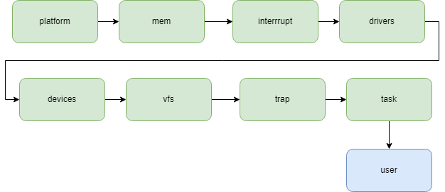

# Subsystem

这一阶段，我们将原来的内核划分为一些较为松耦合的子系统。子系统与我们之前的模块化工作有相似之处，但是目标不一样。简单来说，之前的模块化是将内核中可独立的部分脱离内核，从而可被其它内核所复用，而现在我们将内核继续划分，这些划分的子系统有点类似linux中的各个子系统，比如内存管理子系统、平台相关子系统、任务子系统等，这些子系统只是对原来的内核的交互进行了梳理，使得各个子系统之间的依赖关系，信息交互更加合理，这些子系统与我们的内核紧密相关，因此大多数不能被其它内核所使用。

目前系统被划分为几个较为简单的子系统：

1. `config`：提供内核的相关配置，比如启动栈大小、用户程序栈大小，缓冲区大小等
2. `constants`: 提供内核子系统都会使用的数据结构、常量定义
3. `timer`: 负责几个不同时间定义的获取和转换
4. `arch` : 提供体系结构相关的功能，我们的内核目前只运行在riscv平台上，所以这里只是简单提供一下开关中断/激活页表的功能
5. `platform` : 平台相关的部分，我们的内核可以跑在几个不同的开发板上，这部分主要负责系统的启动和初始的输出初始化，同时，它会提供平台相关的配置，并向外部导出一些基本的平台信息.
6. `device_interface`: 提供各种设备的接口定义，这在设备管理子系统和驱动子系统实现中被引用
7. `devices`: 设备管理子系统，负责扫描、注册所有的设备，同时为这些设备实现VFS相关的接口
8. `drivers`: 驱动子系统，包含了支持的设备的驱动程序，这些驱动程序可能会需要任务管理子系统的功能，并且需要实现`device_interface`中定义的接口
9. `interrupt`: 负责注册、管理和分发外部中断处理
10. `ksync`: 只是对内核锁的简单封装
11. `mem` : 建立内核的映射，并负责管理整个系统的页分配、内存分配
12. `vfs`: 负责注册内核支持的文件系统，并建立文件系统树
13. `unwinder`： 内核崩溃处理
14. `knet`: 网络相关的数据结构定义和实现
15. `kernel`: 这部分包含了内核的所有系统调用实现，负责进行进程/线程的管理，以及中断/异常处理，其会协调其它子系统的初始化，然后使用其它子系统的数据和功能


系统的启动流程大致如下所示




这些子系统比较核心的的是`device` `drivers` `knet` `mem` `vfs` `kernel`。其中`kernel`部分作为系统中最核心的部分，需要协调各个子系统之间的初始化，并且通过调用这些子系统提供的功能，完成大多数系统调用的实现。在`device`和`drivers`的实现中，可能需要涉及到任务管理相关的功能，

首先对于`drivers`来说，一些设备可能需要实现非阻塞的功能，这需要在适当的时候进行任务切换并在中断到来后进行任务唤醒，这会产生一个依赖倒置的现象，即虽然这些驱动会被在任务管理子系统进行初始化之前被使用，但它们却依赖了任务管理子系统的功能。但因为这些依赖并不会在第一次使用驱动进行设备初始化的时候使用，我们可以不让`drivers`子系统直接依赖`kernel`，而是在`kernel`的初始化过程中将依赖注入，这通常需要定义接口来完成：

```rust
pub trait DriverTask: Send + Sync + DowncastSync {
    fn to_wait(&self);
    fn to_wakeup(&self);
    fn have_signal(&self) -> bool;
}

impl_downcast!(sync DriverTask);

pub trait DriverWithTask: Send + Sync {
    fn get_task(&self) -> Arc<dyn DriverTask>;
    fn put_task(&self, task: Arc<dyn DriverTask>);
    fn suspend(&self);
}

static DRIVER_TASK: Once<Box<dyn DriverWithTask>> = Once::new();
```

通过这种方式，可以将各个子系统进行更强的解耦，但是一个负面作用是需要一个集中地来负责注入相关的依赖。

`devices`子系统同样也会有这样的问题，虽然我们目前不知道是否是因为系统的设计不够合理导致的这种状况的发生，但这并不是什么棘手的问题。

不过仍然有一些子系统可能会直接进行依赖，比如`vfs`和`devices`, 因为在`vfs`建立文件树的过程中，需要根据已有的设备信息建立`/dev/`目录，暂时还没有更好的方式来解决这个问题。

在`kernel`中，因为各个系统调用的实现，中断/异常处理与任务管理子系统紧密相关，将他们进行拆分显得不是那么容易和直观，将他们放在一起同时也利于阅读和检查。

